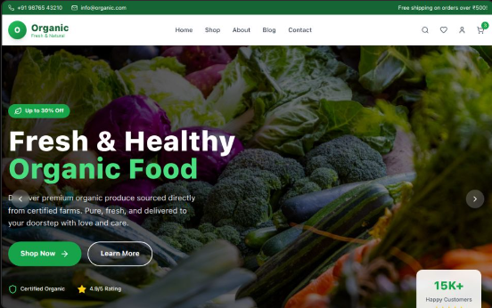

Here’s an updated and polished README for your **Organic Store** project based on the Grow README, adjusted for **Vite + React + Tailwind + TypeScript**:

<p align="center">
  
</p>

---

# Organic Store

Welcome to **Organic Store** – a modern platform connecting local producers, farmers, and consumers to promote sustainability, reduce food miles, and lower environmental impact. Our mission is to create a more eco-friendly food supply chain by connecting local farmers directly with consumers, minimizing long-distance transport, and fostering sustainable agricultural practices.

At Organic Store, we empower local communities, provide fresh and local food to consumers, and contribute to a greener planet. Join us in making food sourcing more transparent, efficient, and sustainable!

---

## Table of Contents

* [Features](#features)
* [Technologies Used](#technologies-used)
* [Installation](#installation)
* [Payment Processing](#payment-processing)
* [Contributing](#contributing)

---

## Features

* **User Authentication**: Secure login and registration for producers, farmers, and consumers.
* **Product Listings**: Producers and farmers can list their products with detailed descriptions and prices.
* **Voice Recognition**: Basic ML model integration for recognizing voice commands and enhancing user experience.
* **Payment Gateway**: Seamless and secure transactions using Stripe.
* **Sustainability Focus**: Connects local producers with consumers to reduce food miles and promote eco-friendly practices.

---

## Technologies Used

### Frontend

* **Vite**: Modern, fast build tool for frontend development.
* **React**: JavaScript library for building UI components.
* **TypeScript**: Adds type safety for better maintainability.
* **Tailwind CSS**: Utility-first CSS framework for rapid styling.
* **Axios**: Promise-based HTTP client for API requests.


## Installation

1. **Clone the repository**

```bash
git clone https://github.com/yourusername/organic-store.git
cd organic-store
```

2. **Install dependencies**

* Frontend:

```bash
cd frontend
npm install
```

* Backend (if exists):

```bash
cd backend
npm install
```

3. **Set up environment variables**

* Create a `.env` file in your `backend` (or project root if fullstack is in one repo) and add:

```env
MONGO_URI=your_mongodb_connection_string
STRIPE_SECRET_KEY=your_stripe_secret_key
STRIPE_PUBLISHABLE_KEY=your_stripe_publishable_key
```

4. **Start development servers**

* Backend:

```bash
cd backend
npm start
```

* Frontend:

```bash
cd frontend
npm run dev
```

Open [http://localhost:5173](http://localhost:5173) to view the app.

---

## Contributing

We welcome contributions!

1. Fork the repository.
2. Create a new branch:

```bash
git checkout -b feature/your-feature-name
```

3. Make your changes and commit:

```bash
git commit -m 'Add some feature'
```

4. Push to the branch:

```bash
git push origin feature/your-feature-name
```

5. Open a Pull Request for review and merging.

---


Do you want me to **also add a “Live Demo” section and badges** for GitHub like build status, license, etc., to make it more professional?
